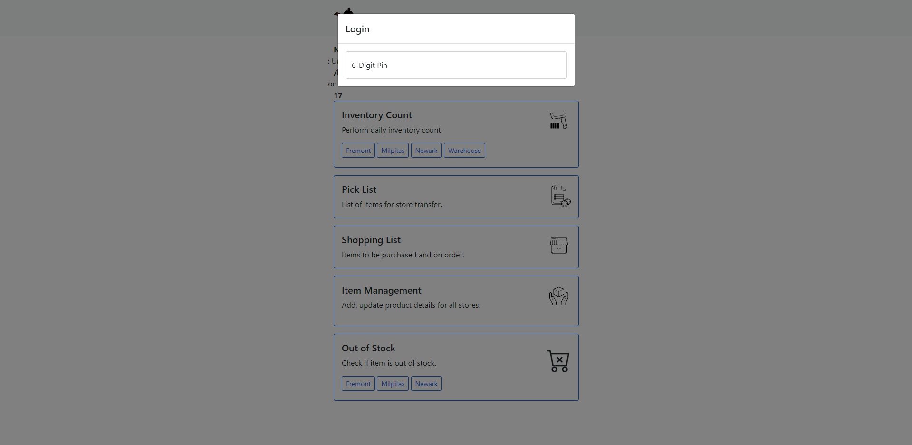
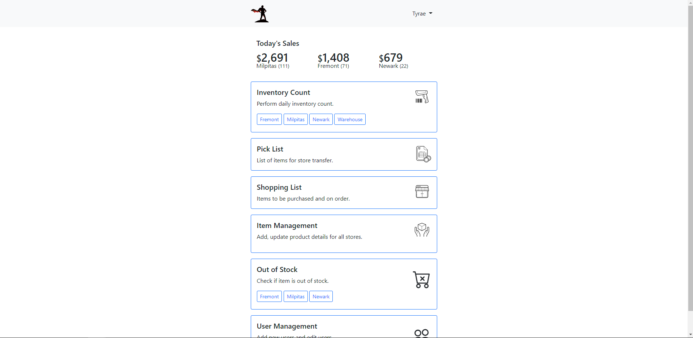
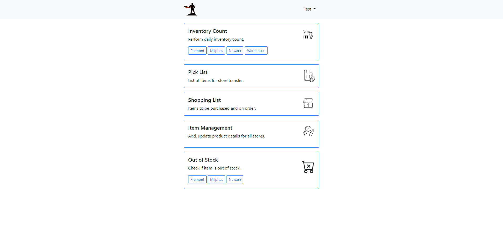
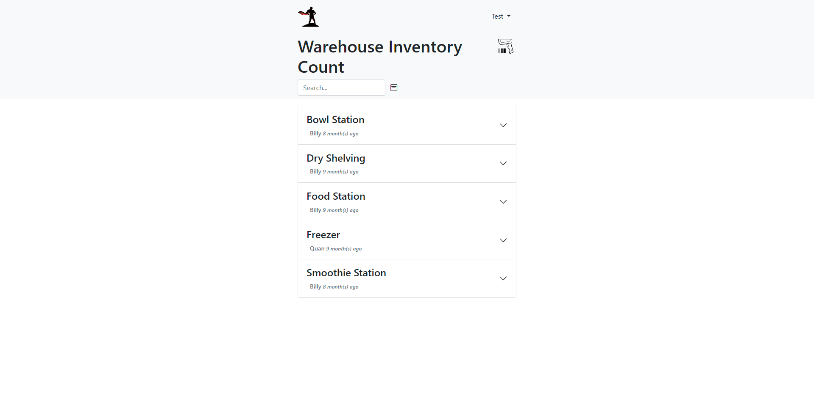
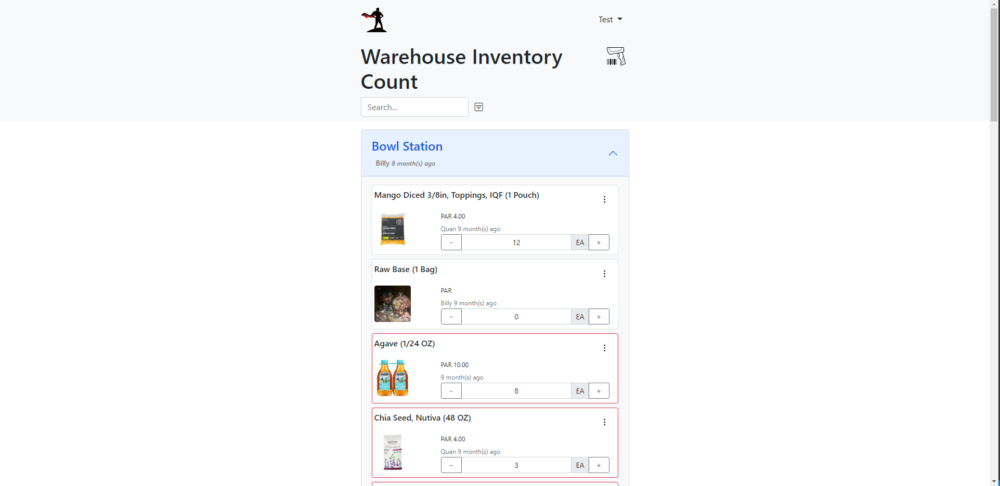

<!--
*** Thanks for checking out the Best-README-Template. If you have a suggestion
*** that would make this better, please fork the repo and create a pull request
*** or simply open an issue with the tag "enhancement".
*** Don't forget to give the project a star!
*** Thanks again! Now go create something AMAZING! :D
-->

<!-- PROJECT SHIELDS -->
<!--
*** I'm using markdown "reference style" links for readability.
*** Reference links are enclosed in brackets [ ] instead of parentheses ( ).
*** See the bottom of this document for the declaration of the reference variables
*** for contributors-url, forks-url, etc. This is an optional, concise syntax you may use.
*** https://www.markdownguide.org/basic-syntax/#reference-style-links
-->

[![Contributors][contributors-shield]][contributors-url]
[![Forks][forks-shield]][forks-url]
[![Stargazers][stars-shield]][stars-url]
[![Issues][issues-shield]][issues-url]
[![MIT License][license-shield]][license-url]
[![LinkedIn][linkedin-shield]][linkedin-url]

<!-- PROJECT LOGO -->
 

<h3 align="center">Inventory Hero</h3>

  

    Inventory Management App for Restaurant
  

  
To test the website click <a href="https://ih.rawasf.com">here</a> PW:111111

<!-- TABLE OF CONTENTS -->

  
Table of Contents

  <ol>
    <li>
      <a href="#about-the-project">About The Project</a>
      <ul>
        <li><a href="#built-with">Built With</a></li>
      </ul>
    </li>
    <li><a href="#usage">Usage</a></li>
    <li><a href="#contact">Contact</a></li>
  </ol>

<!-- ABOUT THE PROJECT -->

## About The Project

[![Product Name Screen Shot][product-screenshot]](https://ih.rawasf.com/)

As the original repository contains some information that I would like to keep private, I created this one to showcase the web application. However, if you would like to check out the website without admin rights, I created a test account for that. [Link](https://ih.rawasf.com) PW: 111111

I created this web application because the restaurant I worked for did not have an inventory management system. So, I developed the Inventory Hero app. It uses PHP, HTML, CSS, JS, mySQL and Bootstrap and is connected with a sql relational database. The purpose of this mobile/web app is to be used to communicate with the inventory team. The inventory team job is to deliver items requested by the restaurant via the app.

(<a href="#top">back to top</a>)

### Built With

- [AWS](https://aws.amazon.com/rds/)
- [Bootstrap](https://getbootstrap.com)
- [JQuery](https://jquery.com)

(<a href="#top">back to top</a>)

<!-- USAGE EXAMPLES -->

## Usage

This usage example is for someone who is going to be updating the inventory list.

As soon as you enter the site, you are prompted to login. If you did not have a login you would have to contact the owner of the store to create one via the admin menu.

After logging in, you can see the whole webpage and if you are an admin, you can see the sales and user management.

As you can see, a person without admin rights cannot see sales or user management.
The person checking the stock of the item will then update inventory count for the delivery team by clicking on the inventory count page and updating it.

The items marked in red are the items that the inventory deliverer needs to pack and deliver to the restaurant.

(<a href="#top">back to top</a>)

## Contact

Your Name - [@Tyao25567946](https://twitter.com/Tyao25567946) - yaotyrae@gmail.com

Project Link: [https://github.com/Midcrash/Inventory-Hero](https://github.com/Midcrash/Inventory-Hero)

(<a href="#top">back to top</a>)

<!-- MARKDOWN LINKS & IMAGES -->
<!-- https://www.markdownguide.org/basic-syntax/#reference-style-links -->

[contributors-shield]: https://img.shields.io/github/contributors/Midcrash/Inventory-Hero.svg?style=for-the-badge
[contributors-url]: https://github.com/Midcrash/Inventory-Hero/graphs/contributors
[forks-shield]: https://img.shields.io/github/forks/Midcrash/Inventory-Hero.svg?style=for-the-badge
[forks-url]: https://github.com/Midcrash/Inventory-Hero/network/members
[stars-shield]: https://img.shields.io/github/stars/Midcrash/Inventory-Hero.svg?style=for-the-badge
[stars-url]: https://github.com/Midcrash/Inventory-Hero/stargazers
[issues-shield]: https://img.shields.io/github/issues/Midcrash/Inventory-Hero.svg?style=for-the-badge
[issues-url]: https://github.com/Midcrash/Inventory-Hero/issues
[license-shield]: https://img.shields.io/github/license/Midcrash/Inventory-Hero.svg?style=for-the-badge
[license-url]: https://github.com/Midcrash/Inventory-Hero/blob/master/LICENSE.txt
[linkedin-shield]: https://img.shields.io/badge/-LinkedIn-black.svg?style=for-the-badge&logo=linkedin&colorB=555
[linkedin-url]: https://linkedin.com/in/tyrae-yao-08b684154
[product-screenshot]: images/Capture4.PNG
